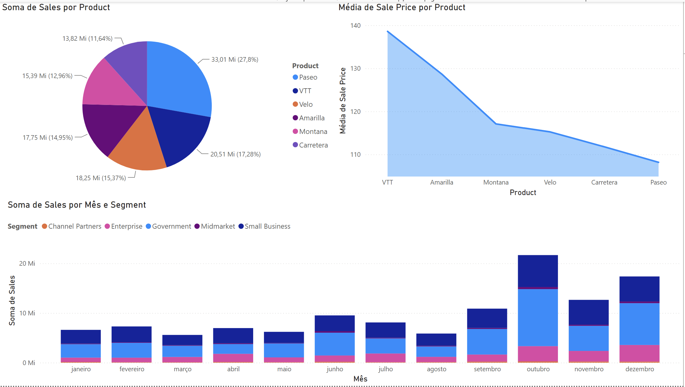
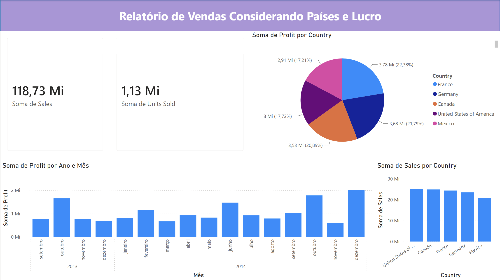
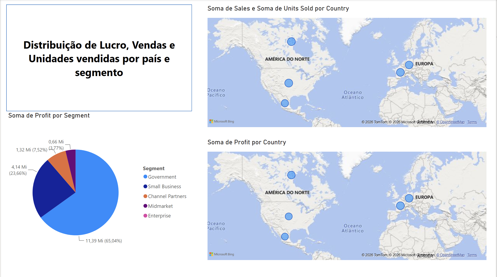

# 📊 Dashboard de Vendas com Power BI

Projeto desenvolvido para o desafio **Analisando Dados com SQL Analytics e Power BI**, da plataforma **DIO (Digital Innovation One)**.

O objetivo foi recriar um dashboard de vendas utilizando Power BI Desktop, explorando indicadores, gráficos, mapas e visualizações interativas para análise de desempenho comercial.

---

# 📌 Objetivo

Construir um dashboard contendo diferentes tipos de visualizações para apresentar informações de vendas, lucro e unidades comercializadas, utilizando os recursos nativos do Power BI.

---

# 🛠 Tecnologias utilizadas

- Power BI Desktop
- SQL Analytics (conceitos do curso)
- Visualizações nativas do Power BI

---

# 📄 Estrutura do Dashboard

O projeto foi dividido em três páginas.

## Página 1 — Produtos e Segmentos

Nesta página são apresentados:

- Gráfico de Pizza (Sales por Produto)
- Gráfico de Área (Média do Preço por Produto)
- Gráfico de Colunas Empilhadas (Vendas por Mês e Segmento)

### Preview

---

## Página 2 — Países e Lucro

Dashboard com indicadores e comparativos entre países.

Inclui:

- Cards de Total de Vendas
- Cards de Unidades Vendidas
- Lucro por País
- Vendas por País
- Lucro por Ano e Mês

### Preview

---

## Página 3 — Distribuição Geográfica

Visualização dos dados através de mapas.

Contém:

- Mapa de Vendas e Unidades Vendidas por País
- Mapa de Lucro por País
- Gráfico de Pizza por Segmento

### Preview

---

# 📁 Arquivo do Projeto

O dashboard completo pode ser aberto através do arquivo:

`Dashboard_Vendas_PowerBI.pbix`

---

# 🎯 Aprendizados

Durante este desafio foram praticados conceitos como:

- Construção de dashboards
- Organização de relatórios
- Utilização de diferentes visuais
- Indicadores (Cards)
- Mapas geográficos
- Segmentação de informações
- Boas práticas de layout

---

# 👨‍💻 Autor

**Matheus Silva Santos**

- LinkedIn: www.linkedin.com/in/matheus-silva-santos-ti
- GitHub: https://github.com/theusbiel739
